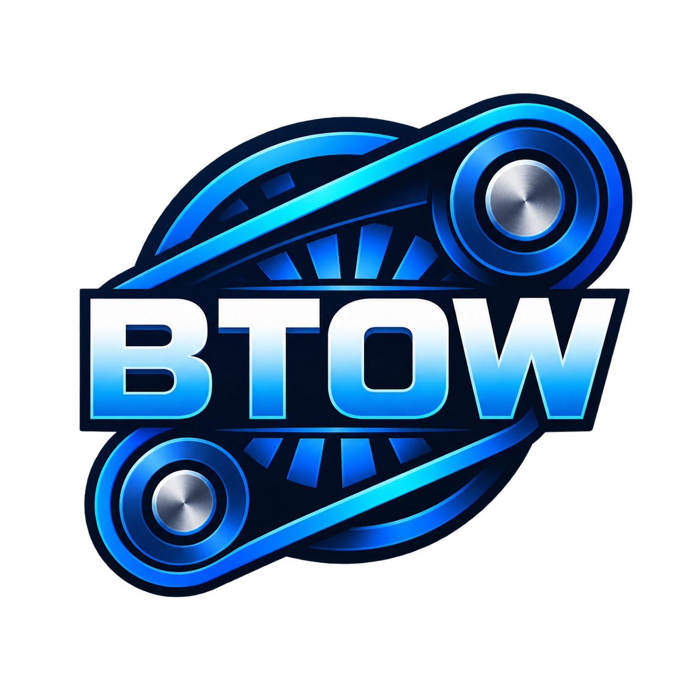
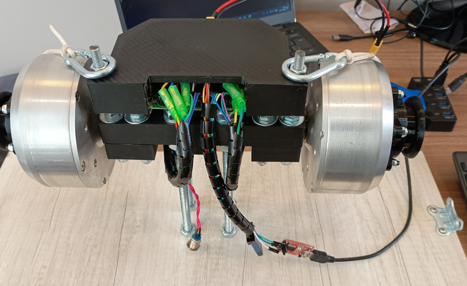
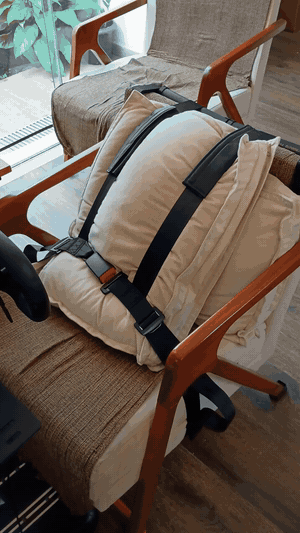
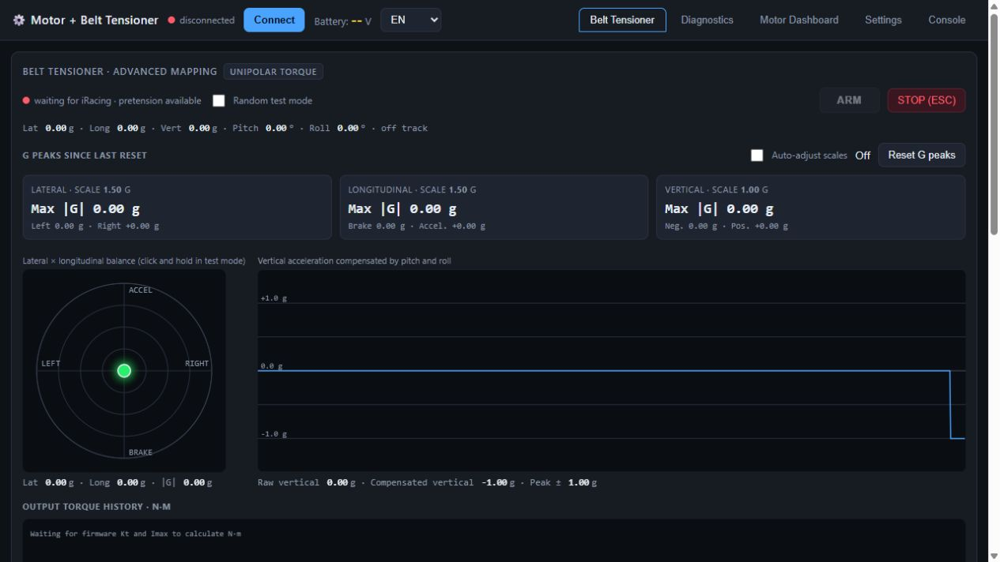

# BT-Wheel — Belt Tensioner for iRacing

BT-Wheel turns iRacing acceleration telemetry into independent torque commands for two belts. I built it around two BLDC motors, MT6701 encoders, a modified hoverboard controller and a PC application.





This is my assembly with 3D-printed supports and a cover. Follow the [build and setup tutorial](docs/TUTORIAL.md) for wiring, resistor modifications and software setup. Wire colors in the photos are not a wiring standard.

BT-Wheel is an experimental project, not a certified restraint device. Provide an accessible manual belt release and a physical stop. Software protections do not guarantee release in every failure.

## Belt tensioner in action



Watch my belt tensioner operating: [download the demonstration video](https://raw.githubusercontent.com/eagabriel/BT-Wheel/refs/heads/main/docs/images/belt-tensioner-demo.mp4) (MP4, approximately 48 MB). Open the downloaded file in your video player; GitHub's file page does not provide inline playback for this video.

## How it works

```text
iRacing → Python / pyirsdk → G mapping → WebSocket → dashboard
                                                      ↓ USB–UART
                            motors ← FOC firmware ← torque commands
```

The backend reads telemetry and calculates torque. The dashboard sends commands through the Web Serial API. The firmware controls current, reads encoders and enforces local limits. Use ST-Link to flash/debug the firmware and a separate USB–UART adapter for PC communication.

Braking adds tension to both belts. Lateral acceleration adds tension to the corresponding side. The vertical effect uses the magnitude of gravity-compensated vertical acceleration. Pretension maintains base tension. Transient belt loosening during acceleration is not implemented.

## Project components

| Component | Purpose |
| --- | --- |
| Python application | Read iRacing, calculate torque and serve the local interface |
| HTML/JavaScript dashboard | Settings, graphs, synthetic tests and serial communication |
| MCU firmware | Dual FOC control, MT6701 feedback, limits and command deadman |
| Compatible hoverboard board | Power stages and current sensing |
| Two BLDC motors and MT6701 encoders | Independent belt actuation |
| Pulleys, belts and frame | Mechanical force transmission |
| Supply and regeneration handling | Supply energy and manage overvoltage |

## Software features



Select English or Portuguese in the header. Hover over controls for explanations. The [tutorial](docs/TUTORIAL.md) includes real screenshots of settings, motors, diagnostics and the console. Missing readings are expected with serial disconnected.

- Pretension, lateral, longitudinal braking and vertical effects.
- Pitch/roll gravity compensation, dead zones, curves and EMA smoothing.
- Manual/automatic G scales and resettable peak-G tracking.
- Independent attenuation from 100% to 50%, in 1% steps.
- G-ball, vertical history and torque-command history in N·m.
- Automatic JSON settings persistence and separate JSON export/import for motor and belt profiles; board parameters and calibration saved separately in flash.
- Motor dashboard and serial console.
- Individual/bilateral step diagnostics, RAM capture and CSV export.
- MT6701-based RPM limiting and firmware command deadman.

Torque readings are estimates. Command conversion uses `Kt × Imax`; measured current estimates electromagnetic torque. Neither directly measures belt force. Validate belt pull mechanically, accounting for friction, pulley radius and calibration.

## Getting started

Read the [build, installation and usage tutorial](docs/TUTORIAL.md) and the [serial protocol](docs/PROTOCOLO_SERIAL.md).

### Windows executable — no Python required

Open `HoverBelt.exe` from a compiled distribution. It starts the local server and desktop window, which requires Microsoft Edge WebView2 Runtime. For browser serial access, open `http://127.0.0.1:8000` in Chrome or Edge and keep the executable running. Run only one server instance.

The local build produces `pc-software/dist/HoverBelt.exe`. A GitHub release download is not available yet. The PC executable does not flash the controller; use ST-Link separately.

### Python source

Install Python 3.10+ and run from the repository root:

```powershell
cd pc-software
python -m venv .venv
.\.venv\Scripts\python.exe -m pip install -r requirements.txt
.\.venv\Scripts\python.exe run.py
```

Open `http://127.0.0.1:8000` in desktop Chrome or Edge. Serial requires Web Serial API support. The server listens only on the local computer.

To open, build and flash the firmware in **VS Code with PlatformIO IDE**, follow tutorial section 4. Synthetic test mode can move motors when connected and armed.

## Folder layout

```text
BT-Wheel/
  pc-software/
    backend/             telemetry, mapping, server and JSON persistence
    frontend/            main dashboard and profile import/export
    assets/              application resources
    tests/               application checks
    app.py               pywebview desktop entry point
    run.py               browser server entry point
    requirements.txt     Python dependencies
    run*.bat             launch scripts
    build*.bat           executable build scripts
  docs/                  tutorial, protocol and images
  firmware/              controller source, drivers and build configuration
    Inc/                 configuration and headers
    Src/                 control loops and drivers
    platformio.ini       TWO_AXIS_VARIANT environment
  mt6701-programmer/      Arduino Pro Micro encoder configuration tool
  Mechanical/            FreeCAD assembly and printed-part designs
```

The PC application is contained in `pc-software/`. Launch `run.bat` there, and use `build.bat` or `build-debug.bat` there to package it. Synthetic test mode is available inside the dashboard. Open `firmware/` or `mt6701-programmer/` separately in PlatformIO; each has its own build configuration. Generated caches and executables are excluded from source control.

## Safety and limitations

The firmware requires renewal of `T/TX/TY` within 150 ms; the dashboard has a 250 ms telemetry watchdog. These mechanisms reduce torque in some failures but cannot guarantee mechanical release during every lockup.

Board-temperature monitoring and the dedicated emergency-stop input exist in the code but are disabled in the current configuration. Check the flashed build and wiring before relying on a protection.

## Credits and licensing

I adapted the telemetry signal-conditioning and filtering approach from [mherbold/MarvinsAIRARefactored](https://github.com/mherbold/MarvinsAIRARefactored) for BT-Wheel's belt effects. Credit goes to mherbold and the project's contributors. BT-Wheel applies this processing to independent motor torque commands rather than servo-position commands; it does not reproduce the full application. The referenced project is GPLv3-licensed; this acknowledgment does not replace its applicable license obligations.

The firmware derives from [EFeru/hoverboard-firmware-hack-FOC](https://github.com/EFeru/hoverboard-firmware-hack-FOC) and the [SiMachines fork](https://github.com/SiMachines/hoverboard-firmware-hack-FOC). Preserve their credits and the firmware's GPLv3 license when redistributing it. The application's distribution license still needs to be formalized; this README does not change existing licenses.

Project repository: [eagabriel/BT-Wheel](https://github.com/eagabriel/BT-Wheel).
