# Build, configure and use BTOW

This guide covers my build and the software version documented on October 2, 2026. Application and firmware are in separate folders. Match the firmware pinout to your board revision before wiring anything.

## 1. Parts and tools

- A compatible hoverboard controller and MCU configuration.
- Two BLDC motors and two MT6701 encoders configured for PWM. Use the Arduino Pro Micro firmware in `mt6701-programmer` to configure the sensors.
- Encoder magnets and mounts, pulleys, belts and a rigid frame. The FreeCAD mechanical project is in `Mechanical`.
- A compatible 24–36 V supply with suitable regeneration handling.
- ST-Link for SWD programming.
- A USB–UART adapter with 3.3 V logic.
- Windows and desktop Chrome or Edge. Python 3.10+ is needed only for source execution, not the executable.
- PlatformIO, optionally VS Code with PlatformIO IDE.
- iRacing for driving telemetry; synthetic test mode works without it.

My board uses an AT32F403RCT6. PlatformIO declares `genericSTM32F103RC` with `STM32F103RCTx_FLASH.ld`. Check the MCU-specific build define, clock and pinout for your board. The target name alone does not establish compatibility with every board.

### Required: configure both encoders for PWM output

**Both MT6701 encoders must be configured for PWM output before using this controller firmware.** Connecting an encoder does not configure its output mode, and flashing the hoverboard controller does not perform this step. The current firmware reads PWM on PB6 (Y) and PB10 (X), not runtime I2C angle data.

I provide separate **Arduino Pro Micro programming firmware** in the repository's [mt6701-programmer folder](../mt6701-programmer/README.md) to configure the MT6701 for PWM mode. Use its programming instructions and wiring to configure each encoder, then connect its PWM output to the corresponding controller input. Verify PWM feedback on both axes before applying torque.

## 2. Mechanical assembly

Secure motors and printed mounts to the frame. Align and secure magnets and sensors. Guard pinch points and keep belt paths clear of sharp edges. Provide a manual release usable with power off.


The assembled unit with its printed supports and cover. This photograph is not proof of load capacity or safety certification.

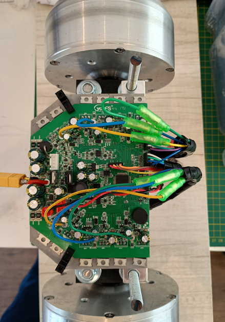

My pulley is 38 mm. If this is its **effective diameter**, the radius is 0.019 m:

```text
ideal belt force [N] = torque [N·m] / radius [m]
1 N·m / 0.019 m ≈ 52.6 N
```

This ignores losses and the increasing radius as the belt winds up. There is no universal conversion from vehicle G to force on the driver.

## 3. Wiring and board modifications

### Important: verify hardware modifications on your own board

I mapped the MCU signal connections from the configuration and initialization code in the firmware. This is a reliable reference for the logical pins used by that firmware version; it does not verify the connector routing or components fitted to every board revision. Check that your flashed version uses the same pinout.

**I strongly recommend checking the original schematic against your actual board before changing pull-ups, removing resistors or installing bridges.** The component references and suggested modifications in this guide were reconstructed from photographs, schematics and source code with AI assistance. They may contain identification or interpretation errors and are not guaranteed to be correct for your board.

With power disconnected, verify component references, signal continuity and the supply rail used by each pull-up. Check resistor values and the encoder module's logic levels before soldering. Do not treat an annotated image or an AI-assisted interpretation as a validated electrical design. If the schematic and your board disagree, resolve that difference before modifying or powering the hardware.

| Signal | MCU pin | Connection |
| --- | --- | --- |
| Left/Y MT6701 PWM | PB6 | Y encoder PWM output |
| Right/X MT6701 PWM | PB10 | X encoder PWM output |
| USART3 TX | PC10 | USB–UART RX |
| USART3 RX | PC11 | USB–UART TX |
| Logic ground | GND | Common reference for adapter and sensors |

### Connection overview

Use the original schematics below to trace each MCU pin through its net alias to the physical connector. Earlier AI-edited overview images have been withdrawn from this tutorial because they incorrectly mapped PB10 and J7.

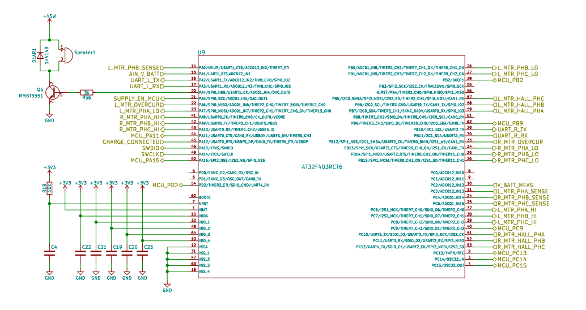

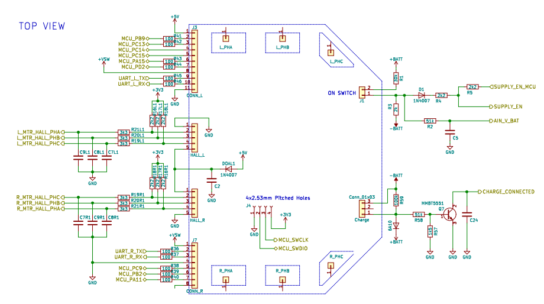

### Series resistors, signal capacitors and pull-ups

In my build, I removed the six **3.3 kΩ series resistors** in the Hall networks and bridged the two pads of each component. The connector schematic labels them R211L, R201L, R191L and R191R, R201R, R211R; reference formatting varies between drawings. A bridge joins the resistor pads; it does **not** short the signal to GND or a supply. Do not apply this change indiscriminately to the UART connectors' 100 Ω resistors.

The external pull-ups are **2.2 kΩ connected to 3.3 V**. The detail below shows R161L/R171L/R181L and R18R1/R17R1/R16R1. Check the populated network on your revision. External resistors and MCU internal pulls are separate things.

**Remove the six signal-to-GND capacitors in the two Hall networks as well.** In the schematic detail below, the left network labels are C9L1, C8L1 and C7L1; the right network labels are C7R1, C9R1 and C8R1. Verify these references against your board revision before removing components. These are the Hall signal-filter capacitors, not the board's power-supply decoupling capacitors.

**Leave capacitor pads open—do not bridge them.** Unlike the series resistors, these capacitors connect each signal to GND; bridging their pads would short the signal to ground. Removing them avoids filtering the encoder PWM edges through these networks. Use the original schematic detail below and the written instructions to verify component references.

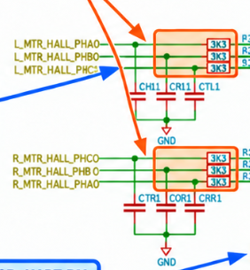

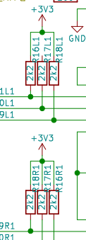

| Schematic point | Firmware use | Notes |
| --- | --- | --- |
| PC10 | Remapped USART3 TX → USB–UART RX | Push-pull output; physical routing must be traced separately, not assumed from UART_R_TX |
| PC11 | Remapped USART3 RX ← USB–UART TX | Internal pull-up enabled; physical routing must be traced separately, not assumed from UART_R_RX |
| J3 UART_L, PA2/PA3 | USART2 disabled in this configuration | Not the application's serial port |
| Left Hall PHC, PB6 | Encoder Y PWM | Internal pull-down enabled |
| U9 pin 29, PB10 → UART_R_TX → R36 (100 Ω) → J7 pin 2 | Encoder X PWM | J7 pin 2 receives the right encoder PWM, despite the historical UART net name |
| U9 pin 30, PB11 → UART_R_RX → R37 (100 Ω) → J7 pin 3 | Not the remapped PC11 serial input | Historical UART net name does not determine current firmware use |

The schematic explicitly routes **PB10 to J7 pin 2 via the UART_R_TX net and R36**. Connect the right encoder PWM to that signal, verifying continuity with power disconnected. A net named UART_R_TX can carry encoder PWM: its name describes the original board function, not the current firmware configuration. Do not confuse the PB10/PB11 UART_R nets with the firmware's remapped PC10/PC11 serial port.

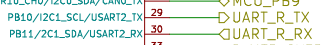

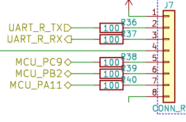

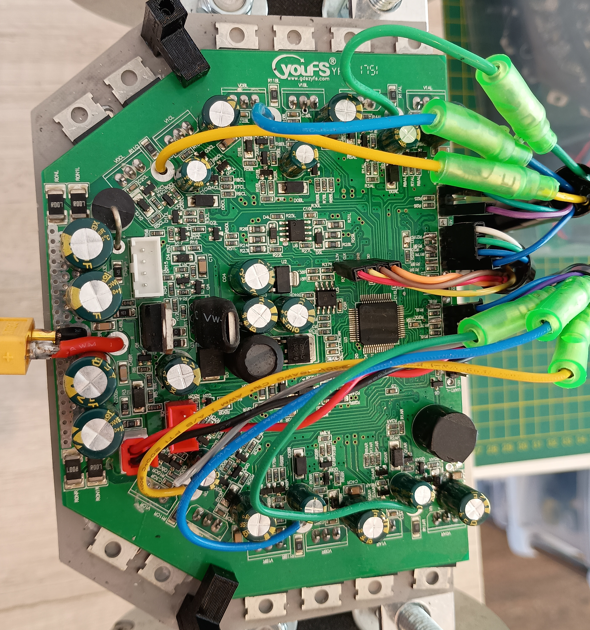

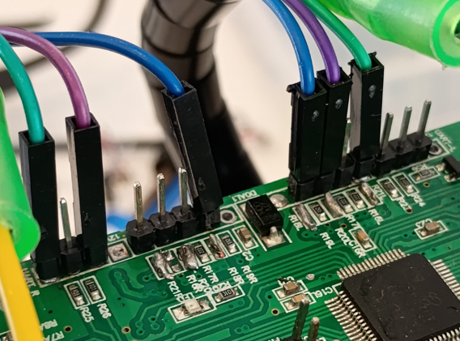

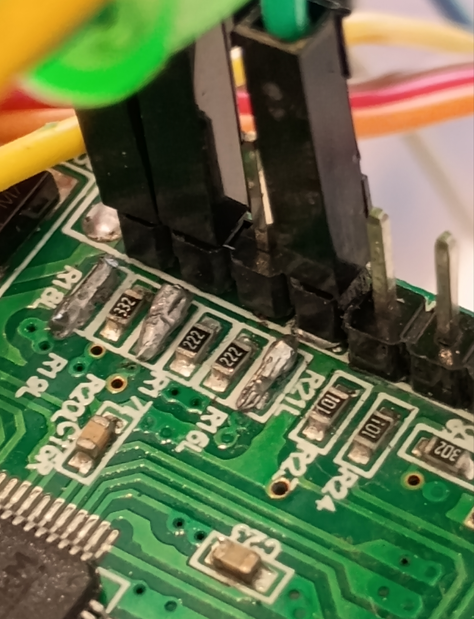

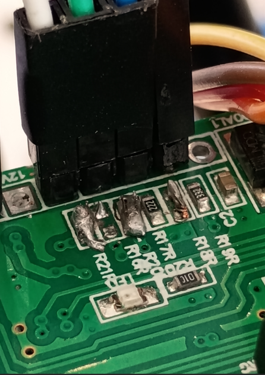

The marking `222` means 2.2 kΩ; `101` means 100 Ω. Check bridge continuity and absence of unintended shorts between signals, GND and supplies before powering up. These changes apply to my build, not automatically to every board. Wire colors are not a pinout standard.

USART3 uses partial remapping. Do not use default PB10/PB11 serial wiring: PB10 is the X encoder input. See `Src/setup.c` and `Src/mt6701_pwm.c`.

Keep MCU inputs compatible with 3.3 V logic. Check your MT6701 module's supply and output levels; commercial modules vary. Never connect RS-232 directly or power motor stages from ST-Link/USB–UART.

Connect ST-Link to SWDIO, SWCLK, GND and the appropriate target voltage reference. Identify points by schematic and continuity. Phase, power and braking-resistor wiring must match your board.

## 4. Build and flash the firmware

### Option A — VS Code with PlatformIO IDE

1. Install VS Code and **PlatformIO IDE**. Let tool installation finish and restart if requested.
2. Select **File → Open Folder** and open the repository's `firmware/` folder, containing `platformio.ini`, `Src` and `Inc`.
3. Open the PlatformIO sidebar and wait for project detection.
4. Select **Project Tasks → TWO_AXIS_VARIANT → General → Build**.
5. Confirm `SUCCESS`. The binary is `.pio/build/TWO_AXIS_VARIANT/firmware.bin`.
6. Connect ST-Link, keep everyone out of the belts and make the mechanism safe. Select **Upload** in the same task group to flash and verify.

If VS Code shows **No solution** or no tasks, open the firmware folder, not a single file or the Python application. PlatformIO uses `platformio.ini`, not a `.sln` file. Check the extension is installed and enabled.

### Option B — terminal

From the repository root, enter the firmware folder:

```powershell
cd firmware
pio run -e TWO_AXIS_VARIANT
```

If `pio` is not on PATH, use your local executable:

```powershell
& "$env:USERPROFILE\.platformio\penv\Scripts\platformio.exe" run -e TWO_AXIS_VARIANT
```

Connect ST-Link and make the mechanism safe, then upload:

```powershell
pio run -e TWO_AXIS_VARIANT -t upload
```

### Option C — prebuilt binary, without VS Code

In STM32CubeProgrammer, select ST-Link/SWD, connect, choose the `.bin`, set address `0x08000000`, program and verify. Check programmer support for your MCU. This does not require VS Code or PlatformIO on the flashing PC. Avoid unnecessary full-chip erases: they can remove saved configuration/calibration.

## 5. Install the PC application

Use the executable or Python source. Run only one server instance: both use port 8000.

### Option A — Windows executable, no Python required

1. Obtain `BTOW.exe` from a compiled distribution or check [GitHub Releases](https://github.com/eagabriel/BTOW-BeltTensioner/releases). Local builds produce `pc-software/dist/BTOW.exe`; older builds used the name `HoverBelt.exe`.
2. Copy and open it on your PC. No Python or `pip install` is required.
3. It starts `http://127.0.0.1:8000` and opens a desktop window requiring **Microsoft Edge WebView2 Runtime**.
4. For browser serial access, open the same address in Chrome or Edge and select **Connect**. Keep the executable running.
5. Stop/disarm before closing the application.

The executable does not flash the board; use ST-Link separately. On startup failure, check `btow-error.log` next to the executable. Settings remain under `%LOCALAPPDATA%\HoverBelt` for compatibility with existing installations; renaming the application does not reset profiles.

### Option B — Python source

From the repository root, enter `pc-software/` before installing or running the application:

```powershell
cd pc-software
python -m venv .venv
.\.venv\Scripts\python.exe -m pip install -r requirements.txt
.\.venv\Scripts\python.exe run.py
```

Open `http://127.0.0.1:8000` in Chrome/Edge. Keep the terminal open; `Ctrl+C` stops the server. With `run.bat`, dependencies must be installed in the environment used by `python`.

`app.py` opens the pywebview window. Verify its serial support; use Chrome/Edge for your first connection test.

### Build your executable

With `python` on PATH, run `pc-software/build.bat` (or `build.bat` if already inside `pc-software/`). It installs build dependencies and packages the server/interface using PyInstaller into `pc-software/dist/BTOW.exe`. **It removes existing build and dist folders inside `pc-software/`**: back up wanted artifacts first. The executable runs on another Windows PC without Python, with WebView2 Runtime available. The batch scripts select their own working folder, so launching them by double-click also works.

## 6. Initial configuration and alignment

Select **EN** in the header. Screenshots show the real application with serial disconnected. Empty fields and graphs are not test results; slider defaults are not approved settings for your hardware.

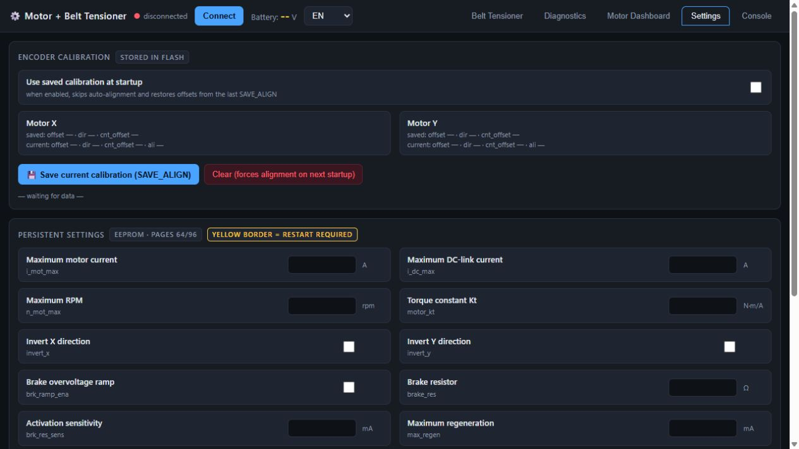

The upper section contains saved encoder calibration and current, RPM and Kt settings. Electrical values remain empty until received from the board.

1. Keep everyone out of the belts and provide immediate access to stop and power disconnect.
2. Select **Connect** and choose USB–UART. Close other programs using the same COM port.
3. Open **Settings** and select **Reload from board**.
4. Check motor/DC-link current limits, RPM, directions and Kt. Firmware defaults are not automatically safe for your build.
5. Check detection and alignment of both encoders. Alignment can move motors.
6. Use **Save current calibration** only after alignment. Enable saved calibration at boot to reuse offsets.
7. **Apply at runtime** changes RAM; **Apply + save to flash** persists settings. Restart-marked fields take effect after reboot.

Command inversion and encoder electrical alignment are different. Phase, sensor or mechanical changes may require recalibration.

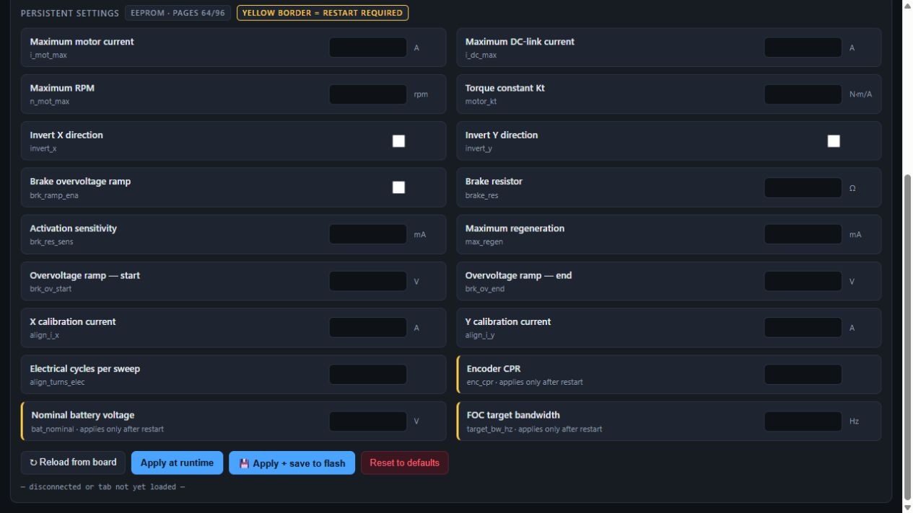

Yellow borders identify restart-required fields. Do not use **Reset to defaults** just to refresh the screen.

### Motor readings and communication

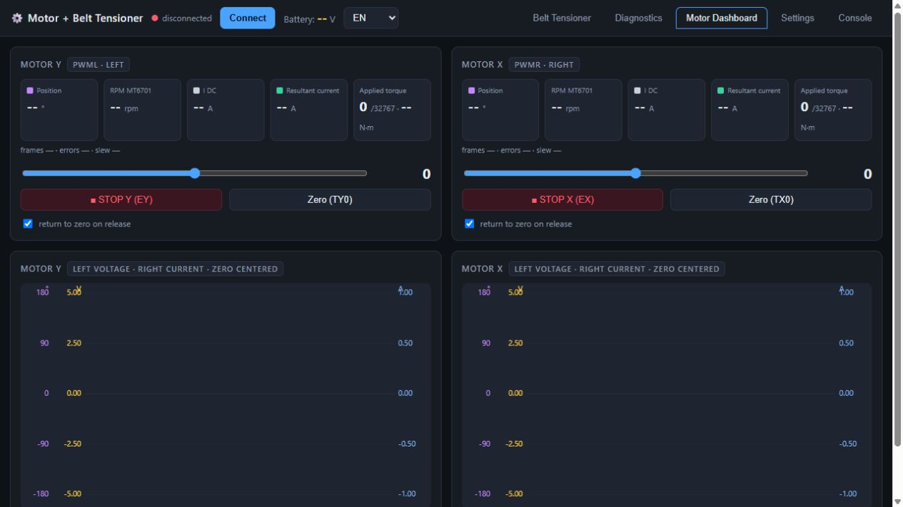

**Motor Dashboard** shows position, MT6701 RPM, DC current, resultant current and torque. Sliders send real commands when connected; do not explore them with someone in the belts. N·m estimates require Kt and firmware data.

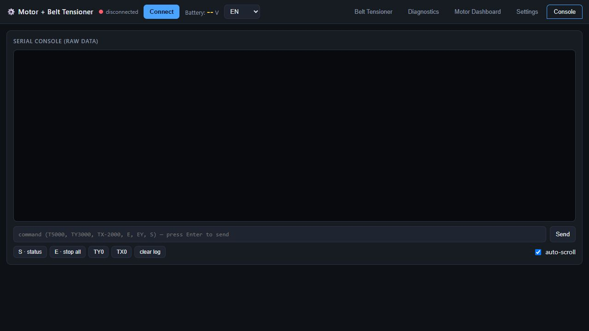

Use **Console** to inspect messages and send commands. Read the [serial protocol](PROTOCOLO_SERIAL.md) first: torque commands can move motors. This screenshot has an empty log because serial is disconnected.

## 7. Bench tests before iRacing

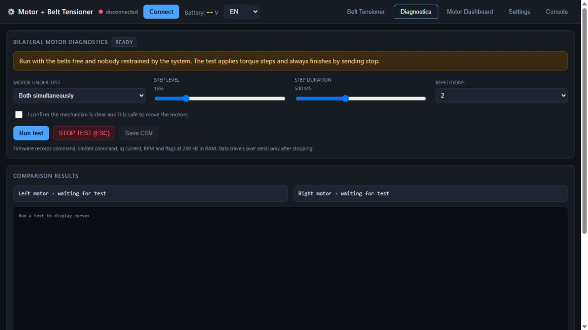

Confirm safe conditions before executing. **Save CSV** becomes available after a capture. The screenshot's 15% and 500 ms are interface defaults, not the first test recommended below.

Start with one motor at a time, 5%, 200 ms and one repetition, a controlled mechanical load and nobody in the belts. Prevent loose belts from whipping; do not rigidly lock the shaft for the first test.

The test renews commands every 50 ms and downloads data after stopping. The RAM buffer holds 512 samples at approximately 200 Hz. Use timestamps for real intervals; the interface rejects sequences exceeding its expected window.

Compare applied command, measured Iq, MT6701 RPM and flags. This is main-loop sampling, not a 16 kHz FOC oscilloscope. Current, rise-time and overshoot summaries are approximations. Use CSV to inspect steps separately and exclude limiter-active intervals.

Conversions: `current [A] = raw / 800`; `MT6701 RPM = raw / 16`. Legacy `n_mot` is not this build's RPM reference.

## 8. Configure belt effects


The upper section contains source, random test mode, arm/stop, peak G, G-ball and histories. Scroll down for effect settings. Hover over controls for explanations.

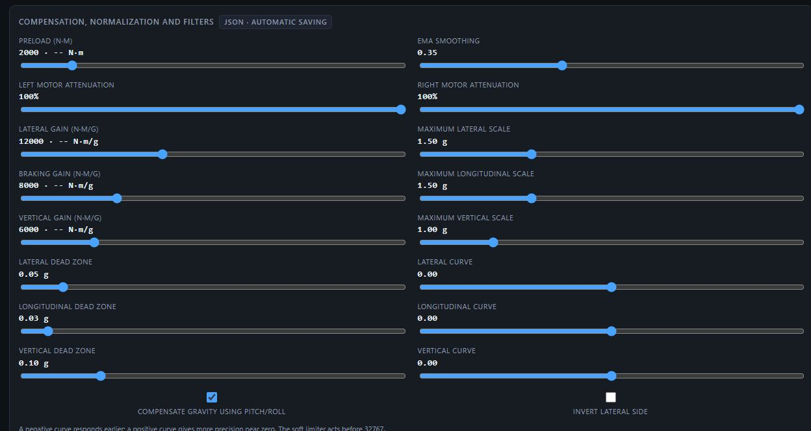

Without valid telemetry, do not interpret compensated vertical readings as real acceleration. N·m conversion needs Kt/Imax from the firmware.

Start with low pretension/gains. Random mode replaces iRacing with synthetic inputs. It produces **real movement** when connected and armed. Make the mechanism safe before selecting **Arm**.

| Setting | Effect |
| --- | --- |
| Pretension | Base torque on both belts |
| Lateral gain | Additional torque on the corresponding side |
| Braking gain | Bilateral torque for negative longitudinal acceleration |
| Vertical gain | Bilateral torque from vertical magnitude |
| G scale | Acceleration corresponding to full normalized effect |
| Curve | Negative responds earlier; zero linear; positive favors stronger inputs |
| Dead zone | Ignore small inputs |
| EMA smoothing | More smoothing adds delay |
| Left/right attenuation | Reduce final commands from 100% to 50% |

N·m/g labels include normalization: the algorithm divides by G scale and applies curves/filtering before gain. They do not imply a constant physical N·m/g relationship over the entire range.

Compare peak G with your scales. Automatic scaling learns above about 32.2 km/h, starts at 1 g, limits growth and decays slowly. It restarts when enabled or entering the track. Use manual scales for repeatable comparisons.

Keep the weaker motor at 100% and attenuate the stronger one. Attenuation does not fix noise, oscillation or calibration errors.

## 9. Use with iRacing

Start iRacing, enter a session and disable random test mode. Verify the source before arming. The current interface allows arming off track: without driving telemetry it applies pretension with a three-second ramp. Returning to the track resumes telemetry-driven effects while armed. **STOP/ESC** disarms; changing tabs interrupts armed control. Do not assume leaving the car releases all tension.

## 10. Settings and backups

### My working example profiles

I include the two profiles I use on my working assembly:

- [Motor settings — btow-motors.example.json](../profiles/btow-motors.example.json).
- [Telemetry belt effects — btow-belt.example.json](../profiles/btow-belt.example.json).

Use them as a reference for a comparable build, not as universal safe defaults. My motor profile uses a 10 A motor-current limit, a 400 rpm speed limit, Kt = 0.551 N·m/A, a 24 V nominal supply and a 3 Ω braking resistor. Verify these settings, DC-link current, regeneration handling and direction against your actual hardware before applying them. The belt profile includes nonzero pretension and substantial gains; start with reduced limits/gains and nobody restrained by the belts.

1. Back up your current motor and belt settings using **Export JSON**. Stop diagnostics, disarm the system and keep the mechanism safe.
2. Connect the controller, open **Settings / Config**, reload from the controller, then use **Import JSON** to load the motor example. Review every field before **Apply + save to flash**, and restart for startup-only parameters.
3. Configure and verify encoder calibration for your own assembly. These profiles do not contain encoder calibration offsets and do not replace your saved calibration.
4. With the server connected, open **Belt Tensioner** and use **Import JSON** to load the belt example. This replaces and automatically saves the effect settings; check the save status. It does not arm the system.
5. Check encoder feedback, current, motor directions and belt pull with nobody in the belts before manually arming. Importing successfully does not validate electrical or mechanical safety.

Belt settings are saved to `%LOCALAPPDATA%\HoverBelt\belt_advanced.json`. `belt_tensioner.json` belongs to the legacy backend mapping. Electrical settings/calibration are stored separately in MCU flash.

To change the JSON folder:

Run this from `pc-software/`, where the virtual environment was created:

```powershell
$env:BTOW_CONFIG_DIR = 'C:\BTOW-config'
.\.venv\Scripts\python.exe run.py
```

Back up JSONs and record board parameters before firmware or mechanical changes.

### Export and import portable profiles

Use **Export JSON** and **Import JSON** separately in the Config and Belt Tensioner tabs. Each download contains one profile type, with a version number. Export includes the currently displayed values, including edits not yet applied; it is not a fresh read from controller flash. In Config, use **Reload from controller** first if you want to back up the controller's current settings.

- **Motor profile:** importing fills the Config fields for review only. Check current, speed, direction and braking settings against your hardware, then use **Apply + save to flash**. Restart the controller for startup-only fields. Saved encoder offsets, directions and the saved-calibration startup switch are deliberately excluded and left unchanged.
- **Belt Tensioner profile:** importing replaces the telemetry-to-torque settings, including gains, pretension, curves, filters, normalization, gravity compensation, left/right attenuation and automatic scaling. The server must be connected; settings are saved to the existing individual JSON file and loaded on the next startup. Check the automatic-save status for errors.

Both imports disarm the belt system and require manual arming afterward. Stop diagnostics before importing. Invalid, incomplete, out-of-range or wrong-type profiles are rejected before settings change. Motor Kt and current limit are stored in the motor profile, so restore both profiles for consistent N·m displays. Test-source selection, arming state and diagnostic results are not configuration profiles and are not restored.

## 11. Troubleshooting

| Symptom | Check |
| --- | --- |
| Serial adapter missing | Driver, compatible browser and available COM port |
| iRacing unavailable | Active session, Python environment and source |
| N·m unavailable | Receive Kt/Imax from controller |
| Zero RPM while moving | MT6701 wiring/configuration and diagnostic firmware |
| Unrealistic current in older diagnostics | Divide raw Iq by 800 |
| Command cutouts | RPM, configured limit and flags |
| One side oscillates | Capture CSV; check sensor, mechanics and calibration before PI tuning |
| Executable closes at startup | Read btow-error.log |

## 12. Safety protections and limits

Firmware command deadman: 150 ms. Dashboard watchdog: 250 ms. The firmware also checks main-loop progress during manual commands. These cannot cover every failure, including lockups preventing protection code from running.

`ENABLE_BOARD_TEMP_SENSOR` and `ESTOP_ENABLE` are disabled in current `config.h`. The proposed emergency input uses PA3 and conflicts with a brake-input option. Provide an accessible mechanical release and suitable physical stop; the screen button does not replace them.

## 13. Telemetry processing credit

I adapted the telemetry signal-conditioning and filtering approach from [mherbold/MarvinsAIRARefactored](https://github.com/mherbold/MarvinsAIRARefactored). Thank you to mherbold and the project's contributors for their work. In BT-Wheel, the conditioned telemetry drives independent torque commands for the two motors, rather than servo-position commands. This is an adaptation of the processing approach, not a reproduction of the full application. See the [README's credits and licensing section](../README.md#credits-and-licensing) and the original project's GPLv3 license.
